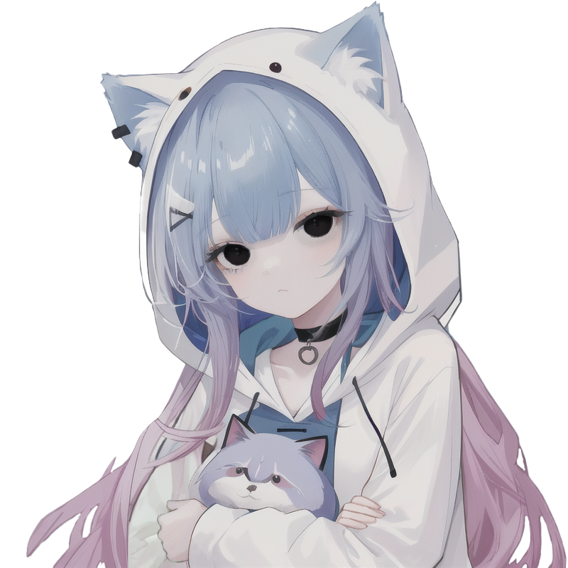

  <h1 align="left"><strong>S H I F T &nbsp; S T U D I O S</strong></h1>

 

**Shift Studios** is a Roblox game development studio with a mission to
create high-quality Roblox games that are both fun and engaging, with a solid gameplay loop that pushes the boundaries
of what Roblox games can be.

### Our Vision
- **Innovation**: Bringing fresh and unique ideas to the Roblox platform.
- **Quality**: Maintaining high standards in game design, visuals, and sound.
- **Community**: Building a strong and inclusive player community.

## Our Team:

<table>
  <thead>
  <tr>
    <th>Profile Picture</th>
    <th>Username</th>
    <th>Gender</th>
    <th>About Me</th>
  </tr>
</thead>
<tbody>
    <tr>
      <td align="center">
        
      </td>
      <td align="center"><strong>Shirroz</strong></td>
      <td align="center">Male</td>
      <td align="center">Founder of Shift Studios. Known as the E-Girl of the team, I am a scripter and UI designer.</td>
    </tr>
    <tr>
      <td align="center">
        
      </td>
      <td align="center"><strong>T_ANP (Tanpyy)</strong></td>
      <td align="center">Male</td>
      <td align="center">Co-founder of Shift Studios. I primarily focus in Scripting, map design, and a little bit of UI design. I've worked on multiple side projects that are mainly fighting / horror games</td>
    </tr>
  </tbody>
</table>

  <h1 align="right"><strong>O U R &nbsp; W O R K</strong></h1>

### Time Shift:
Our game TimeShift is our current project. You can play singlplayer, or in a party of up t 4. YOu will then be put into the game where you will have 2 distinct worlds. The past, and the present. You then need to use these worlds, and shift through them to get to the end of the level.
